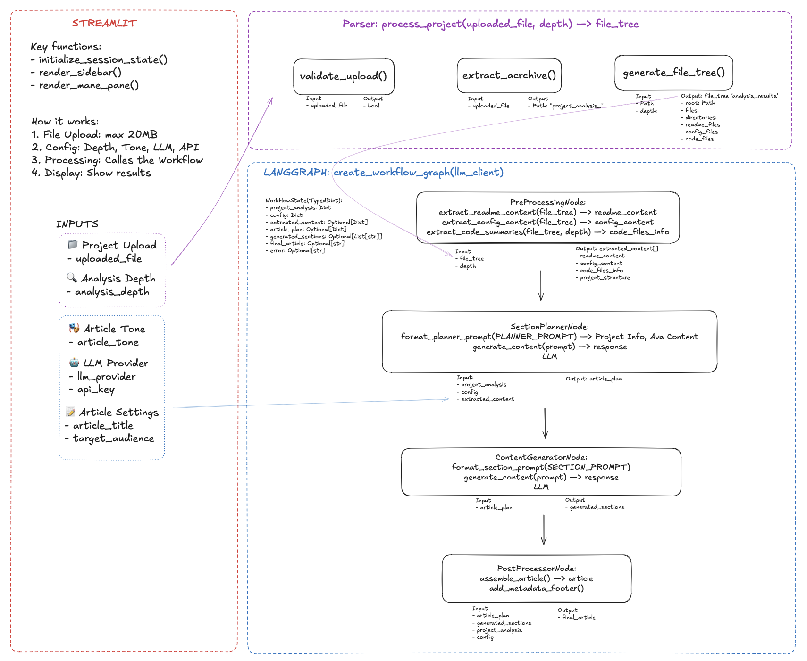

# Project-to-Article Generator



## 🎯 Why This Project Exists

**Problem**: Developers spend countless hours writing technical articles to showcase their projects, but this process is time-consuming and often repetitive. Many great projects go undocumented because developers lack the time or writing skills to create compelling technical content.

**Solution**: An AI-powered system that automatically transforms code projects into engaging technical articles, making project documentation effortless and consistent.

## 🚀 How It Works

The Project-to-Article Generator uses a sophisticated AI workflow to analyze your codebase and generate comprehensive technical articles. Here's the high-level process:

### 1. **Project Analysis** 
- Uploads and extracts your project archive (ZIP/TAR.GZ)
- Analyzes file structure, README files, and source code
- Identifies key components, dependencies, and architecture patterns

### 2. **Content Planning**
- Uses AI to understand your project's purpose and technical stack
- Generates a structured article outline based on your project's complexity
- Adapts content strategy to your chosen tone and target audience

### 3. **Article Generation**
- Leverages multiple LLM providers (OpenAI GPT-4, Anthropic Claude, Google Gemini)
- Generates section-by-section content with technical accuracy
- Incorporates code snippets, explanations, and best practices

### 4. **Final Assembly**
- Combines all sections into a cohesive markdown article
- Adds metadata, formatting, and professional styling
- Provides ready-to-publish content for blogs, documentation, or portfolios

## 🏗️ Technical Architecture

The system is built with modern AI/ML practices and follows a modular, scalable architecture:

### **Frontend Layer**
- **Streamlit UI**: Clean, intuitive interface for project upload and configuration
- **Real-time Feedback**: Progress indicators and status updates during processing
- **Responsive Design**: Works seamlessly across different devices and screen sizes

### **Processing Pipeline**
- **Project Parser**: Extracts and analyzes project structure using intelligent file categorization
- **LangGraph Workflow**: Orchestrates the entire article generation process with state management
- **Multi-Provider LLM Integration**: Supports multiple AI providers with automatic fallback

### **AI/ML Components**
- **Content Planning Node**: Uses AI to create article structure and outline
- **Section Generation Node**: Generates individual article sections with context awareness
- **Post-Processing Node**: Assembles and formats the final article with metadata

### **Key Technical Features**
- **Configurable Analysis Depth**: Overview (README-focused) or Detailed (full codebase analysis)
- **Tone Customization**: Explanatory, Conversational, or Marketing styles
- **API Key Management**: Secure handling of multiple LLM provider credentials
- **Error Handling**: Graceful degradation with mock clients for testing

## 🎯 Use Cases

### **For Developers**
- **Portfolio Enhancement**: Quickly create technical articles for your GitHub projects
- **Documentation**: Generate comprehensive project documentation automatically
- **Knowledge Sharing**: Share your technical insights without the writing overhead

### **For Teams**
- **Onboarding**: Create technical articles for new team members
- **Project Handoffs**: Generate documentation for project transfers
- **Client Deliverables**: Produce professional technical reports for clients

### **For Content Creators**
- **Technical Blogging**: Scale your content creation with AI assistance
- **Tutorial Generation**: Create step-by-step guides from existing projects
- **Educational Content**: Transform code projects into learning materials

## 🚀 Quick Start

### Prerequisites
- Python 3.8+
- pip package manager

### Installation

1. **Clone the repository**
   ```bash
   git clone <repository-url>
   cd project_to_article_app
   ```

2. **Install dependencies**
   ```bash
   pip install -r requirements.txt
   ```

3. **Set up environment variables** (optional)
   ```bash
   # Create .env file
   touch .env
   
   # Add your API keys for real LLM integration
   OPENAI_API_KEY=your_openai_key_here
   ANTHROPIC_API_KEY=your_anthropic_key_here
   GOOGLE_API_KEY=your_google_key_here
   ```
   
   **Note**: API keys are optional. The app will use mock clients for testing if no keys are provided.

4. **Run the application**
   ```bash
   streamlit run app.py
   ```

5. **Open your browser**
   Navigate to `http://localhost:8501`

## 📖 Usage Guide

### Step 1: Prepare Your Project
- Zip your project folder (max 20MB)
- Ensure it includes a README file for better analysis
- Clean up any sensitive information before uploading

### Step 2: Configure Generation Settings
- **Analysis Depth**: Choose between Overview (README-focused) or Detailed (full codebase)
- **Article Tone**: Select from Explanatory, Conversational, or Marketing styles
- **LLM Provider**: Pick your preferred AI model (OpenAI GPT-4, Anthropic Claude, Google Gemini)
- **Target Audience**: Specify the technical level (Beginner, Intermediate, Advanced)

### Step 3: Generate and Review
- Click "Generate Article" and wait for processing (≤60 seconds)
- Review the generated content for accuracy and completeness
- Download as Markdown or copy to clipboard for immediate use

## 🧪 Testing

### Test Real LLM Integration
```bash
python test/test_real_llm.py
```

### Test Complete Workflow
```bash
python test/debug_workflow.py
```

### Visualize Workflow
```bash
python test/visualize_workflow.py
```

## 🤝 Contributing

We welcome contributions! Please see our contributing guidelines for details on:
- Code style and standards
- Testing requirements
- Pull request process
- Issue reporting

## 📄 License

This project is licensed under the MIT License - see the LICENSE file for details.

## 🆘 Support

- **Issues**: Create a GitHub issue for bugs or feature requests
- **Documentation**: Check the PRD.md file for detailed specifications
- **Questions**: Open a discussion for general questions

---

**🎉 Project Status: Production Ready!**

The Project-to-Article Generator is fully functional with real LLM integration, comprehensive testing, and production-ready features. Transform your code projects into compelling technical articles with just a few clicks! 